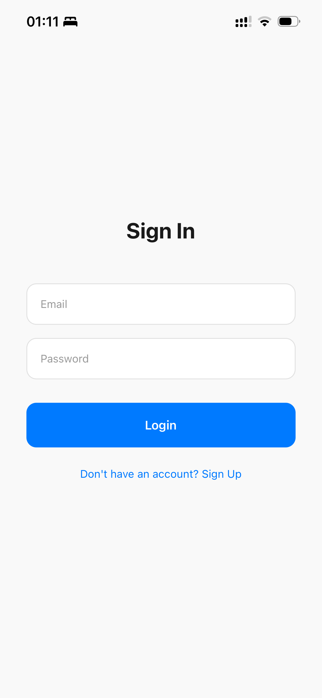
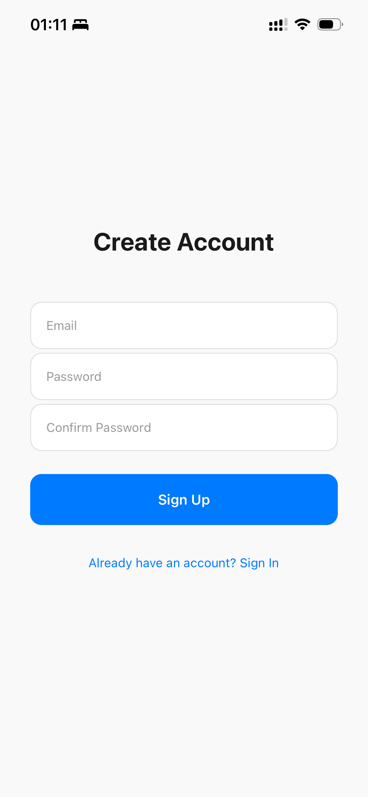
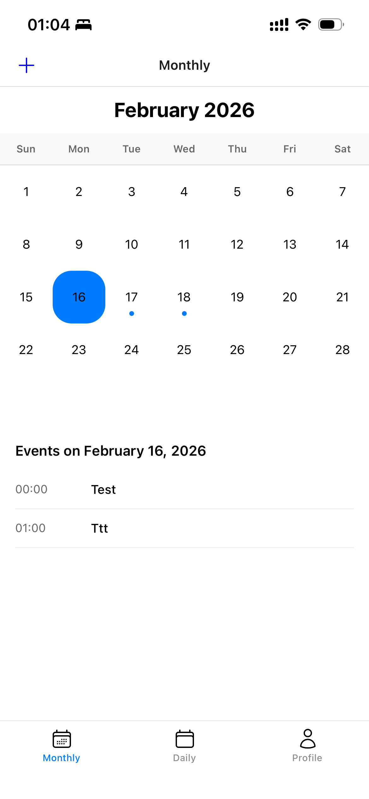
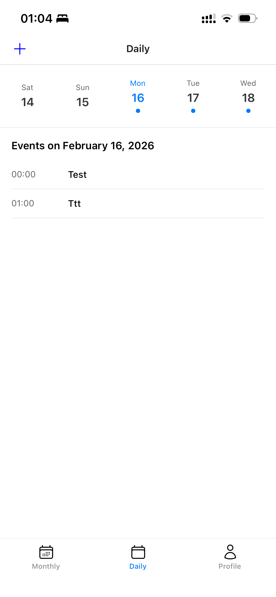
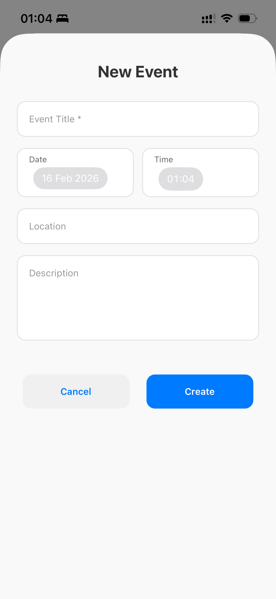
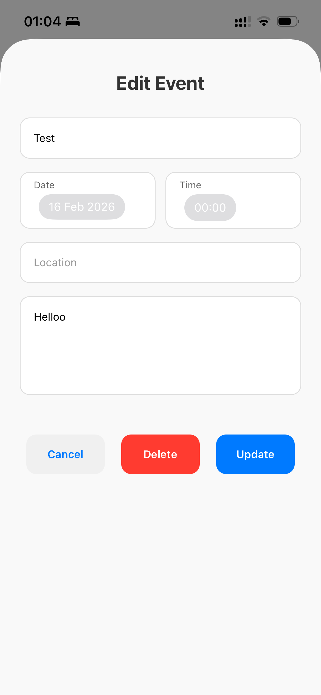
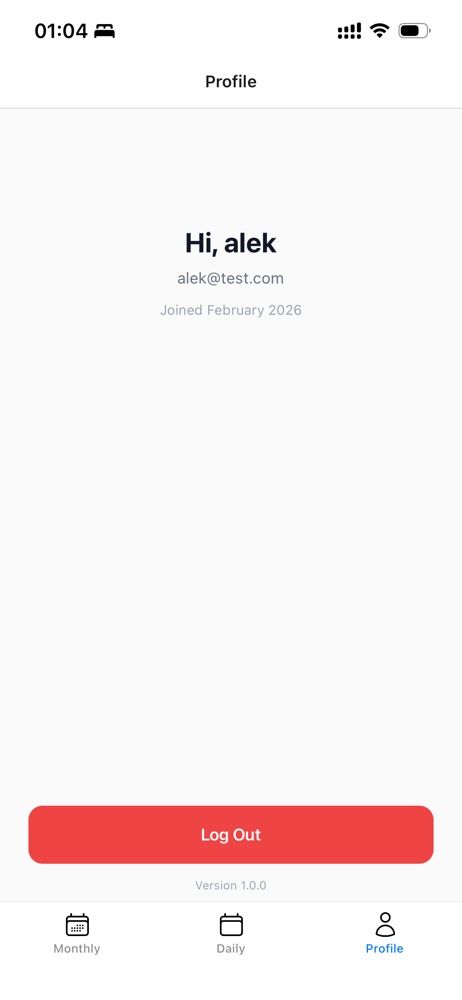

# Calendar App — React Native Test Assignment

**React Native Developer Test Task**

A fully functional calendar application with authentication, biometric login, and custom calendar UI built **without any third-party calendar libraries**.

---

## ✨ Features

### Authentication & Security
- Email + Password Sign Up / Sign In (Firebase Authentication)
- Biometric login (Face ID / Touch ID / Fingerprint) for returning users
- Secure credential storage using `react-native-keychain`
- Protected routes (Calendar & Profile accessible only after login)
- Sign Out from Profile screen

### Calendar
- **Fully custom calendar** (no third-party calendar libraries)
- Switch between **Monthly** and **Daily** views
- Beautiful day grid
- Display events for the selected day
- Create new events
- Edit existing events
- Date & time picker with `@react-native-community/datetimepicker`

### UI/UX
- Modern, clean, custom UI
- Header + Bottom Tab Navigation
- Smooth screen transition animations
- Full support for notches, dynamic islands, and safe areas
- Responsive on all screen sizes (iOS & Android)

### Technical
- 100% TypeScript
- Firebase (Auth + Firestore) as backend
- Zustand for lightweight state management
- Proper project structure and clean code

---

## 🛠 Tech Stack

| Layer              | Technology                                      | Version      |
|--------------------|--------------------------------------------------|--------------|
| Framework          | React Native                                     | 0.83.0       |
| Language           | TypeScript                                       | 5.8.3        |
| React              | React                                            | 19.2.3       |
| Navigation         | React Navigation (Native Stack + Bottom Tabs)    | ^7.x         |
| Animations         | React Native Reanimated                         | ^4.2.1       |
| State Management   | Zustand                                          | ^5.0.11      |
| Backend            | Firebase (Auth + Firestore)                      | ^23.8.6      |
| Biometrics         | react-native-keychain                            | ^10.0.0      |
| Date Utils         | date-fns                                         | ^4.1.0       |
| Icons              | react-native-heroicons                           | ^4.0.0       |
| Testing            | Jest + React Native Testing Library             | —            |

**Node.js requirement**: `>=20` (defined in `engines`)

---

## 🚀 Quick Start

### 1. Clone & Install

```bash
git clone <your-repo-url>
cd calendar_app
npm install
# or
yarn install
```

### 2. Firebase Setup (Important!)

1. Create a project at [Firebase Console](https://console.firebase.google.com)
2. Enable **Authentication** → Email/Password
3. Enable **Firestore Database** (start in test mode or set proper rules)
4. Add Android & iOS apps to the project:
   - Android → download `google-services.json` → put in `android/app/`
   - iOS → download `GoogleService-Info.plist` → put in `ios/`
5. (iOS only) Run:
   ```bash
   cd ios && pod install && cd ..
   ```

### 3. Run the app

```bash
# Android
npm run android

# iOS
npm run ios

# Metro bundler (if needed)
npm start
```

---

## 📱 Screenshots

*(Screenshots are included in the `screenshots/` folder)*

| Login | Register | Month View | Day View + Events |
|-------|----------|------------|-------------------|
|  |  |  |  |

| Create Event | Edit Event | Profile |
|--------------|------------|---------|
|  |  |  |

---

## 🧪 Tests

```bash
npm test
```

- Minimum **5%+ test coverage** achieved (as required)
- Tests cover auth flow, calendar logic, and components

---

## 📂 Project Structure (key folders)

```
src/
├── navigation/          # Root, Auth, App stacks
├── screens/             # Login, Register, Calendar, Profile, EventForm
├── components/          # Custom Calendar, EventCard, etc.
├── store/               # Zustand store and slices (auth, calendar)
├── utils/               # Date helpers, validators
├── types/               # TypeScript interfaces
├── assets/              # Icons, images
└── constants/
```
